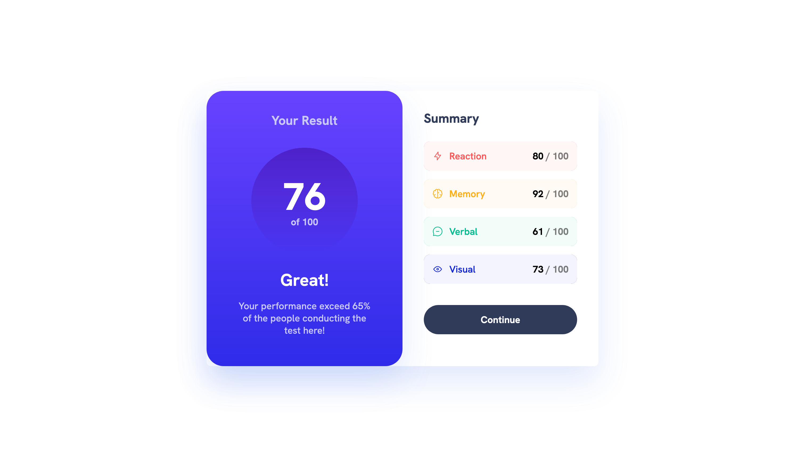

# Frontend Mentor - Results summary component solution

This is a solution to the [Results summary component challenge on Frontend Mentor](https://www.frontendmentor.io/challenges/results-summary-component-CE_K6s0maV).

## Table of contents

- [Overview](#overview)
  - [The challenge](#the-challenge)
  - [Screenshot](#screenshot)
  - [Links](#links)
- [My process](#my-process)
  - [Built with](#built-with)
  - [What I learned](#what-i-learned)

## Overview

### The challenge

Users should be able to:

- View the optimal layout for the interface depending on their device's screen size
- See hover and focus states for all interactive elements on the page

### Screenshot

### Links

- Solution URL: [link](https://github.com/Ruslanmsv/results-summary)
- Live Site URL: [link](https://results-summary.vercel.app/)

### Built with

- Vite
- React
- TailwindCSS
- Typescript
- Flexbox
- Mobile-first workflow

### What I learned

1. How to translate design system into TailwindCSS Config
2. How to do dynamic classes in TailwindCSS
3. How to use index signatures in TypeScript
